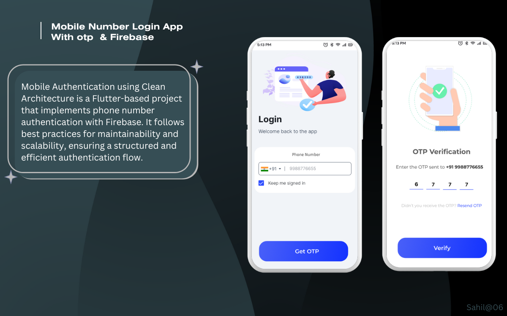

# Mobile Authentication using Clean Architecture  

Mobile Authentication using Clean Architecture is a Flutter-based project that implements phone number authentication with Firebase. It follows best practices for maintainability and scalability, ensuring a structured and efficient authentication flow.  

## Features  
- Phone number authentication using Firebase  
- OTP verification  
- Clean Architecture implementation  
- State management with Provider/BLoC (if applicable)  

## Screenshot  
  

## Setup Instructions  
1. Clone the repository:  
   ```sh
   git clone https://github.com/yourusername/your-repo.git
   cd your-repo
